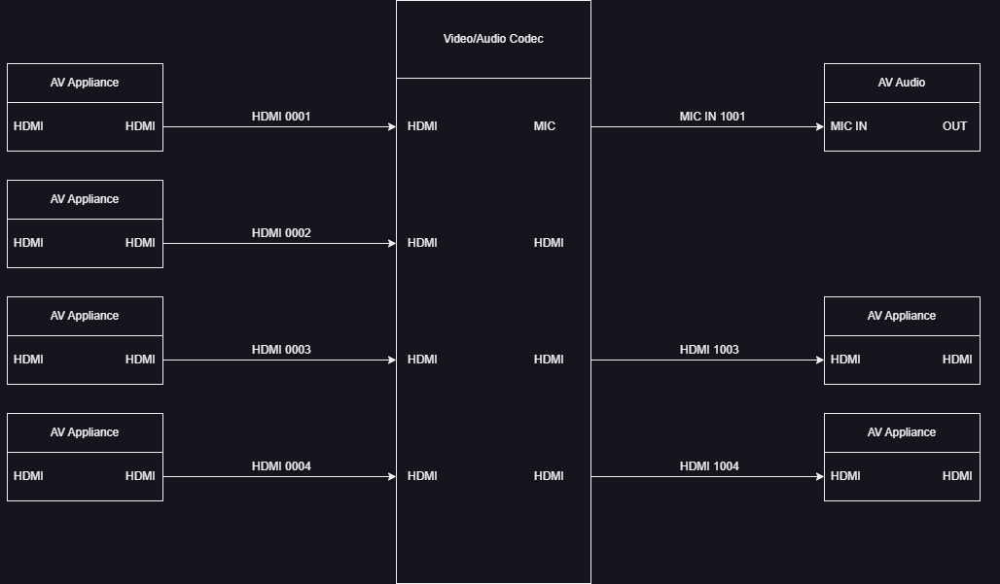

# 🚨 **BREAKING CHANGES** 🚨

- The original Python-only version of Drawmate has been moved to the [`legacy-python`](https://github.com/lando-tech/drawmate/tree/legacy) branch. If you need the old behavior, please continue using that branch.
- **New architecture:** Drawmate now uses a C++ backend via `pybind11`, bundled into a wheel for easier installation.
- **Upcoming releases:** I’ll be pushing wheels for multiple architectures and Python versions via GitHub Releases over the coming weeks.
- **No changes to the JSON API** — existing JSON templates and workflows are still fully compatible.
- **WILL be pip-installable in the future** 🎉  
  Once I have built the wheels, you'll be able to install the new version directly with:
  
  ```
  pip install drawmate
  ```
---

## **Drawmate: Automate Wiremaps and Diagrams with Draw.io**

**Drawmate** is a powerful tool designed to automate the creation of wiremaps and network architecture diagrams using the **Draw.io XML format**. This tool streamlines the diagramming process by utilizing a JSON API to automatically generate basic wiremaps, saving time and effort for network engineers and IT professionals.

## **Key Features**
- 🚀 **Automated Wiremap Generation:** Generate network diagrams quickly using the JSON API.
- 🌐 **Versatile Use Cases:** Ideal for network architecture visualization, infrastructure mapping, and dynamic diagram creation.

## **How It Works**
1. **JSON API Integration:** Input network data through JSON to auto-generate wiremaps.
2. **Scripting Capability:** Extend functionality by scripting advanced layouts with the provided base classes.
3. **Draw.io Compatibility:** Export diagrams in Draw.io XML format for further customization or sharing.

---

### **Usage**
- ```python3 main.py <path/to/input.json> <path/to/output.drawio>```

---

### **Key Points:**
- 📍 **Matrix Positioning:** Set the starting `x` and `y` coordinates for the `Matrix`. All connected nodes will be placed relative to this position.
- 🚫 **Signaling Gaps:** If there is a gap between appliances, pass an empty string (`""`) in the list. 
    - Example: If the `Matrix` has 4 connections but only 3 appliances, include 4 connections in the list with a blank string representing the gap.
- **Connection/Flow:** The arrows/connection currently flow left to right, but this is also easily adjusted.
- **Label Entries:** Label entries follow this basic structure
  - `["Label of appliance", "input/output", "input/output", ["connection-indexes"], ["connection-indexes"]]`
  - ```connection-indexes``` refers to the index location of the ports. Indexes follow the 0 indexing system, 
    so if you have a Node at index 0, but it has two ports on each side, the indexes would be ```[0, 1]```.
  - You can alternatively pass in ```["NONE"]``` and the engine will infer an adjacent connection based on the position of the Node/Port.
    I kept this design to allow for different routing mechanisms in the future.
  - `"connections-left"` refers to the connections on the matrix itself
- **Add more levels:** To add more levels/columns, just use the same naming convention `second-level-left`, `third-level-left` and so on.
- **IMPORTANT:** Make sure the value of `num_connections` matches the number of appliances in each entry.

```json
{
    "graph-dimensions": {
        "dx": 4000,
        "dy": 4000,
        "width": 4000,
        "height": 4000
    },
    "matrices": {
        "labels": "Video/Audio Codec",
        "width": 200,
        "height": 400,
        "x": 2000,
        "y": 2000,
        "num_connections": 4
    },
    "first-level-left": {
        "labels": [
            ["AV Appliance", "HDMI", "HDMI", ["NONE"], ["NONE"]],
            ["AV Appliance", "HDMI", "HDMI", ["NONE"], ["NONE"]],
            ["AV Appliance", "HDMI", "HDMI", ["NONE"], ["NONE"]],
            ["AV Appliance", "HDMI", "HDMI", ["NONE"], ["NONE"]]
        ]
    },
    "first-level-right": {
        "labels": [
            ["AV Audio", "MIC-IN", "OUT", ["NONE"], ["NONE"]],
            ["", "", ""],  // 🚫 Gap between appliances
            ["AV Appliance", "HDMI", "HDMI", ["NONE"], ["NONE"]],
            ["AV Appliance", "HDMI", "HDMI", ["NONE"], ["NONE"]]
        ]
    },
    "connections-left": [
        "HDMI",
        "HDMI",
        "HDMI",
        "HDMI"
    ],
    "connections-right": [
        "MIC",
        "HDMI",
        "HDMI",
        "HDMI"
    ]
}
```
## Output

- This is a very simple implementation, with only one level of connections for a basic AV Codec.
- Here is a view of what the above JSON would output (the numbering system can easily be altered to fit specific use cases):
 
---



---

### **Examples** ###
To see more examples, go to "data/images/" in the project directory.

---

## **Basic Overview**

Drawmate's engine generates a wiremap or diagram using the `Matrix` class as the central component of the layout. The `Matrix` serves as a hub, representing a device such as:

- 🛡️ **Firewall**
- 🖥️ **Switch**
- 🎛️ **Audio/Video Codec**
- 🔗 **Any Centralized Appliance**

## 🧠 **Entry Point: `drawmate.py`**

The `drawmate.py` module `drawmate_engine/drawmate.py` is the primary entry point for Drawmate, handling most of the diagram generation logic. It serves as a **template module**, offering a foundation for contributors to create new diagram templates with minimal effort.

### **How `drawmate.py` Works**
- 🛠️ **Core Logic:** Implements the primary flow for generating wiremaps from JSON input.
- 📑 **Template Structure:** The module follows a modular and reusable design, enabling quick adaptation for new use cases.
- 🔄 **Customizable:** By modifying the core logic, you can easily extend Drawmate's capabilities to support different diagram types.

---

## Author

+ Aaron Newman
+ <aaron.newman@landotech.io>
