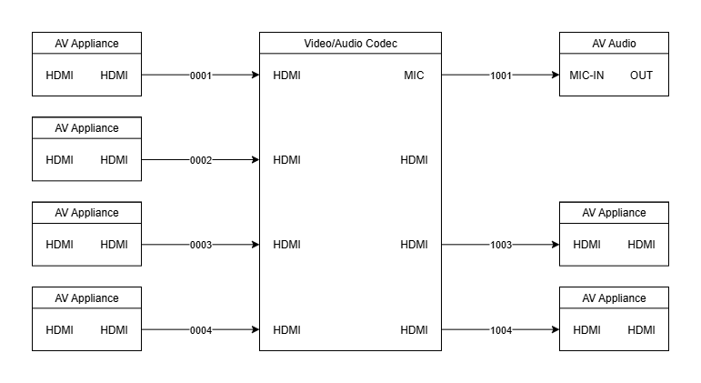

## **Drawmate: Automate Wiremaps and Diagrams with Draw.io**

🎉 **NEW: Version 2.0.0-beta Now Available on TestPyPI!**
- https://test.pypi.org/project/drawmate/
- **Major Update:** Complete rewrite from C++ to pure Python! No more complex build dependencies.
- 📦 **Beta Testing:** `pip install -i https://test.pypi.org/simple/ drawmate`
- 📋 **See [CHANGELOG.md](CHANGELOG.md) for full details on what's new, improved, and fixed.**

**Drawmate** is a powerful tool designed to automate the creation of wiremaps and network architecture diagrams using the **Draw.io XML format**. This tool streamlines the diagramming process by utilizing a JSON API to automatically generate basic wiremaps, saving time and effort for network engineers and IT professionals.

## **Key Features**
- 🚀 **Automated Wiremap Generation:** Generate network diagrams quickly using the JSON API.
- 🌐 **Versatile Use Cases:** Ideal for network architecture visualization, infrastructure mapping, and dynamic diagram creation.

## **How It Works**
1. **JSON API Integration:** Input network data through JSON to auto-generate wiremaps.
2. **Draw.io Compatibility:** Export diagrams in Draw.io XML format for further customization or sharing.

---

## **Installation**

### **📦 TestPyPI (Beta Testing)**
Currently available on TestPyPI for beta testing:
```bash
pip install -i https://test.pypi.org/simple/ drawmate
```

### **🎯 Coming Soon: Official PyPI**
Once testing is complete, the package will be available on the official PyPI:
```bash
pip install drawmate  # Coming soon!
```

### **✅ Benefits of Python Version**
- **No build dependencies** - No more CMake or C++ compiler requirements
- **No architecture-specific builds** - Works across multiple platforms
- **Simple installation** - Standard pip workflow
- **Easy updates** - `pip install --upgrade drawmate`

---

### **Usage**
```man
usage: drawmate [-h] [-v] [-b] [-t] [-l] [-gt] [input_file] [output_file]

positional arguments:
  input_file            The path to the JSON template file. See API documentation for how to format the
                        input file. Alternatively, pass in the '-b' or '--build-template' flag to get a
                        blank starter template in the correct format
  output_file           The path to the drawio.xml output file. Acceptable file extensions are
                        ['.drawio', '.xml', '.drawio.xml']. Drawio will accept any of those three. You
                        can also pass in the '-t' or '--timestamp' flag to append a timestamp to the
                        file.

options:
  -h, --help            show this help message and exit
  -v, --version         Print drawmate version, as well as system information
  -b, --build-template  Interactive guide to build a starter JSON template with valid structure and
                        empty node data.
  -t, --timestamp       Add a timestamp to the output file
  -l, --link-label      Add labels to links based on node positions (e.g., '0101'). See docs for label
                        format.
  -gt, --generate-test  Generate a test JSON template and output Draw.io XML. Test files are saved to
                        ~/.config/drawmate/tests.
```
---

### **Key Points:**
- 📍 **Matrix Positioning:** Set the starting `x` and `y` coordinates for the `Matrix`. All connected nodes will be placed relative to this position.
- 🚫 **Signaling Gaps:** If there is a gap between appliances, pass an empty string (`""`) or the (`__SPAN__`) variable in the list.
    - Example: If the `Matrix` has 4 connections but only 3 appliances, include 4 connections in the list with a blank string or the (`__SPAN__`) variable representing the gap.
- **Connection/Flow:** The arrows/connection currently flow left to right and I am working on a function to allow reversing the flow.
- **Label Entries:** Label entries in the JSON API follow this basic structure:
  - `["Label of appliance", "input" | ["input", "input"], "output" | ["output", "output"], ["connection-indexes"], ["connection-indexes"]]`
  - ```connection-indexes``` refers to the index location of the ports. Indexes follow the 0 indexing system,
    so if you have a Node at index 0, but it has two ports on each side, the indexes would be ```[0, 1]```.
  - You can alternatively pass in ```["NONE"]``` and the engine will infer an adjacent connection based on the position of the Node/Port.
    I kept this design to allow for different routing mechanisms in the future.
  - `"connections-left/right"` refers to the connections on the matrix itself
- **Add more levels:** To add more levels/columns, just use the same naming convention `second-level-left`, `third-level-left` and so on.
- **IMPORTANT:** Make sure the value of `num_connections` matches the number of appliances in each entry.

```json
{
    "graph-dimensions": {
        "dx": 4000,
        "dy": 4000,
        "width": 4000,
        "height": 4000
    },
    "matrices": {
        "labels": "Video/Audio Codec",
        "width": 200,
        "height": 400,
        "x": 2000,
        "y": 2000,
        "num_connections": 4
    },
    "first-level-left": {
        "labels": [
            ["AV Appliance", "HDMI", "HDMI", ["NONE"], ["NONE"]],
            ["AV Appliance", "HDMI", "HDMI", ["NONE"], ["NONE"]],
            ["AV Appliance", "HDMI", "HDMI", ["NONE"], ["NONE"]],
            ["AV Appliance", "HDMI", "HDMI", ["NONE"], ["NONE"]]
        ]
    },
    "first-level-right": {
        "labels": [
            ["AV Audio", "MIC-IN", "OUT", ["NONE"], ["NONE"]],
            ["", "", "", ["NONE"], ["NONE"]],  // 🚫 Gap between appliances
            ["AV Appliance", "HDMI", "HDMI", ["NONE"], ["NONE"]],
            ["AV Appliance", "HDMI", "HDMI", ["NONE"], ["NONE"]]
        ]
    },
    "connections-left": [
        "HDMI",
        "HDMI",
        "HDMI",
        "HDMI"
    ],
    "connections-right": [
        "MIC",
        "HDMI",
        "HDMI",
        "HDMI"
    ]
}
```
## Output

- This is a very simple implementation, with only one level of connections for a basic AV Codec.
- Here is a view of what the above JSON would output (the numbering system can easily be altered to fit specific use cases):

---



---

### **Examples** ###
To see more examples, go to "data/images/" in the project directory.

## Author

+ Aaron Newman
