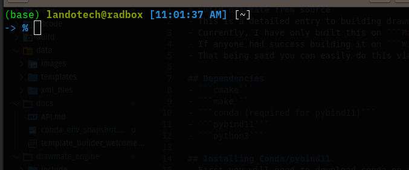
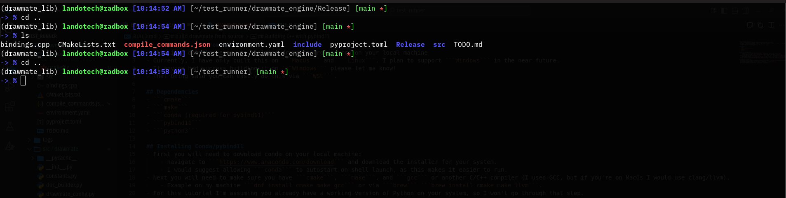
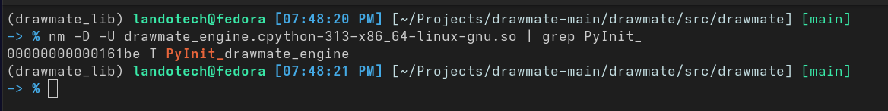

# build drawmate from source
- This is a detailed entry to building the backend for drawmate from source on your local machine.
- Currently, I have only built this on ```macOS``` and ```Linux```. I plan to support ```Windows``` in the near future.
- If anyone has success building it on ```Windows``` please let me know!
- That being said ```WSL2``` is your best bet if on `Windows`, I've compiled the `cmake` project, but I haven't had time to test building the `wheel`.

## Dependencies
- ```gcc``` or ```clang/llvm```
- ```cmake```
- ```make```
- ```conda (required for pybind11)```
- ```pybind11```
- ```python3```

## Installing Conda
- First you will need to download conda on your local machine:
    - navigate to ```https://www.anaconda.com/download``` and download the installer for your system.
    - I would suggest allowing ```conda``` to autostart on shell launch, as this makes it easier to run.

## Installing cmake, make, and C/C++ compiler
- Next you will need to make sure you have ```cmake```, ```make```, and ```gcc``` or another C/C++ compiler (I used GCC, but if you're on ```macOS``` I would use clang/llvm).
    - Example on my machine ```sudo apt install cmake make gcc``` or via ```brew install cmake make llvm``` if you're on ```macOS```.
- For this tutorial I'm assuming you already have a working version of Python on your system, so I won't go through that step.
  However, if anyone reading this needs help doing so, here is a link: ```https://www.python.org/downloads/```.

## Setting up Conda env
- Next you will need to navigate to the source directory of the project: 
```bash
cd /path/to/drawmate/engine/
```
- You'll find a file inside the ```engine``` directory: 
```bash
environment.yaml
```
- If not done so already, activate the base conda environment via: 
```bashe
conda activate base
```
- It should look something like this once its activated: 
    ***
    
    ***
- Next run this command to activate the ```drawmate_lib``` environment:
```bash
conda env create -f environment.yml
``` 
- After ```conda``` finishes installing the new environment, it should automatically activate, but if it doesn't just run:
```bash
conda activate drawmate_lib
```
- Your shell should now look something like this:
    ***
    
    
- Conda usually caches these environments, so if you ever need to reactivate it, just re-run 
```bash
conda activate drawmate_lib
```

## Building via cmake/make
- With your ```conda env``` activated, you are now ready to build the project!
- You'll need to make a build directory at the root of the project: ```mkdir build && cd build```.
- Once inside of build, run: 
```bash
cmake build ..
``` 
- and then 
```bash
make
```
- If the environment is setup properly, it will compile and generate two ```.so``` files.
    - On my machine the ```drawmate_engine.so``` looks like this: 
    ```bash
    src/drawmate/drawmate_engine.cpython-310-x86_64-linux-gnu.so
    ```

- If for some reason you don't see ```cpython``` attatched to the ```.so``` then something likely failed. This must be present
    to ensure ```Python``` recognizes the module.
- The ```drawmate_lib``` file should look something like this: 
```bash
libdrawmate_lib.so
```
- You can inspect the ```cpython``` file with the following command to ensure it compiled correctly: 
```bash
nm -D -Ux drawmate_engine.cpython-310-x86_64-linux-gnu.so | grep PyInit_
```
You should see something like this:
***

***
- If the output of the command above displays something similar to the picture, it should indicate that the file compiled successfully and ```Python```
    should recognize it.

## Final build via python build
- Once you have the two ```.so``` files, they should be labeled something like:
```bash
drawmate_engine.cpython-310-x86_64-linux-gnu.so libdrawmate_lib.so
```
- Ensure that the `python/system/arch` version matches your machine.
- Once you have these two files, they should automatically be place in:
```bash
drawmate/src/drawmate/
```
- If for some reason they failed to build to the right directory, you can manually copy them to:
```
src/drawmate/
```
- Your directory structure should now look like this:
```bash
.
└── drawmate
    ├── constants.py
    ├── doc_builder.py
    ├── drawmate_config.py
    ├── drawmate_engine.cpython-310-x86_64-linux-gnu.so
    ├── drawmate_engine.pyi
    ├── drawmate_renderer.py
    ├── __init__.py
    ├── json2xml.py
    ├── libdrawmate_lib.so
    ├── log_manager.py
    ├── __main__.py
    ├── main.py
    ├── matrix_constants.py
    ├── mxarray.py
    ├── mx_builder.py
    ├── mxcell.py
    ├── mxgeometry.py
    ├── mxobject.py
    ├── mxpoint.py
    ├── pathfinder.py
    ├── _skbuild_project.toml
    └── template_builder.py
```
- ***This step is critical***: ensure you ```DEACTIVATE``` the `conda env` via:
```bash
conda deactivate drawmate_lib
```
- Once conda is deactivated, you will need to build a clean virtual environment (make sure the python version of your venv matches the one on your system!!). Make sure you change back to the root directory of the project and run:
```bash
python -m venv .venv
```
- And activate it:
```bash
source .venv/bin/activate
```

- Once activated you can now install the dependencies:
```bash
pip install -r requirements.txt
```

- Once `pip` finishes, sans any error messages, you can now run the following two commands:
```bash
python -m build
```
```bash
pip install dist/drawmate-v1.2.0*.whl
```
- If you built this from source, and completed it successfully, please let me know! It was a journey to figure this out and I hope anyone reading this finds it helpful!


## Using the interface
- There are five main ```struct``` objects that are exported to ```Python``` via ```pybind11```.
    1. GridConfig
    2. LayoutConfig
    3. CentralNodeConfig
    4. NodeConfig
    5. PortConfig
- These are mostly boilerplate objects that I plan to condense into a more useful config class structure. But for now they are how to instantiate the main
  ```Graph``` class.
- This is a snippet from my ```drawmate_renderer``` module that demonstrates a simple, albeit slightly verbose way of instaniating the ```Graph``` object.
- Note the presence of `# type: ignore`. I've had some issues with `VSCode` recognizing my `.pyi` files so I added that to get rid of the warnings/errors. I'm still working to get better editor/IDE integration.
```python
    def init_graph(self):
        layout_config = drawmate.LayoutConfig( # type: ignore
            base_x=2000.0,
            base_y=2000.0,
            node_spacing_x_axis=250.0,
            node_spacing_y_axis=23.33,
            port_spacing=70.0
        )
        grid_config = drawmate.GridConfig( # type: ignore
            columns_left=self.config.num_levels,
            columns_right=self.config.num_levels,
            rows_left=self.matrix_dims.num_connections,
            rows_right=self.matrix_dims.num_connections
        )
        central_node_config = drawmate.CentralNodeConfig( # type: ignore
            width=200.0,
            height=200.0,
            label_height=23.33
        )
        node_config = drawmate.NodeConfig( # type: ignore
            width=120.0,
            height=70.0,
            label_height=23.33,
        )
        port_config = drawmate.PortConfig( # type: ignore
            port_width=60.0,
            port_height=23.33
        )
        graph = drawmate.Graph(
            layout_config, grid_config, central_node_config, node_config, port_config
        )
        return graph
```
***
***For reference docs, see***:
```bash
src/drawmate/drawmate_engine.pyi
```
***Or reference***:
```bash
engine/bindings.cpp
```
